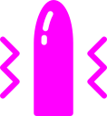

# gspot

 

A Godot 4 Plugin for interacting with intimate haptic devices via the [buttplug.io](https://buttplug.io/) interface.

**This plugin provides a buttplug.io standard compatibile client implementation. To interact with devices a server is also required. See [Intiface Central](https://intiface.com/central/).**

Review the [protocol specification](https://buttplug-spec.docs.buttplug.io/docs/spec) for an idea of how to interact with this plugin and proper device flow.

A [client control panel](addons/gspot/ui/gscontrol_panel.tscn) is provided for testing devices and getting familiar with the client.

## Quick Example
```gdscript
# Get the client from the scene tree.
var client = $GSClient
# Connect to the device server.
client.start("localhost", 12345)
# Wait for connection.
await client.client_connection_changed
# Request the device list from the server.
client.request_device_list()
# Wait for devices to arrive.
await client.client_device_list_received
# Grab the first device.
var device = client.get_device(0)
# Send a vibration command via a scalar feature. This assumes the device supports a Vibrate feature in slot 0.
# Refer to the control panel for a more robust implementation.
client.send_scalar(device.device_index, 0, "Vibrate", 0.5)
```

# Attribution
The gspot icon was created by [Kokota](https://thenounproject.com/kokota.icon/) and distributed under the [Creative Commons Attribution License (CC BY 3.0)](https://creativecommons.org/licenses/by/3.0/)
